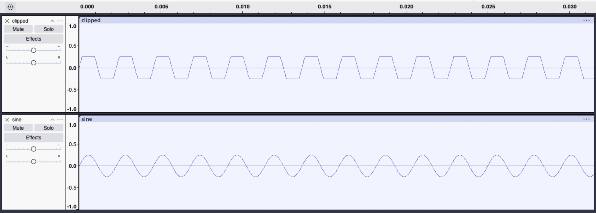

# Clipped Sine Wave - Irvin Lu

## Build and Run Instructions

Tested on Mac OS, Python 3.12

1. Create a virtual environment if desired: `python3 -m venv env`
2. Activate the env: `source env/bin/activate`
3. Install required dependencies: `pip install -r requirements.txt`
4. Run the program: `python3 clipped.py`
5. The program should generate the files `sine.wav`, `clipped.wav`, and play the latter
   wave to audio output.

## What was done

Following the assignment plan and specifications, I wrote clipped.py to construct discretized imitations of continuous sine waves and
create two WAV files: `sine.wav` and `clipped.wav`. Both sine waves were created using a mono channel, a 1-second duration, a 16-bit
signed integer sample format, a 440 Hz frequency, and 48,000 samples per second.

The amplitude for `sine.wav` is 1/4 of the maximum possible 16-bit amplitude (values in the range -8192 to 8192), whereas the amplitude
for `clipped.wav` is 1/2 of the maximum (values in the range -16384 to 16384). However, values within the sine wave for `clipped.wav`
that exceed the 1/4 maximum from the former wave are **clipped** to that threshold, meaning no value in either wave actually exceeds -8192 or 8192. Nonetheless, the sine waves are expected to look different since the sine wave for `clipped.wav` was originally calculated using a higher amplitude (1/2).

The program `clipped.py` creates the two sine waves individually by first calculating an array of time points to discretize the
continuous flow of the sine wave. Using `numpy.linspace`, it generates a time array with 48,000 equally spaced values (the sample rate)
ranging from 0 to the duration (1 second). Next, two arrays, one for each WAV file, use this time array, along with their respective amplitudes, frequency, and the `sin()` function, to generate a sample collection imitating a continuous sine wave.

The sine wave arrays are then cast to 16-bit signed integers to adhere to the expected WAV format, then written to
[`sine.wav`](sine.wav) and [`clipped.wav`](clipped.wav). Finally, the program plays the sine wave from `clipped.wav`
directly to computer audio output, as per the assignment plan.

### Resulting WAVs

Importing the two files into Audacity, notice how the sine wave from `clipped.wav` appears flattened at the -0.25 and 0.25
coordinates when compared to `sine.wav`, showcasing the effects of clipping a 1/2 amplitude sine wave to a limit of 1/4.

## How it went

## What is still to be done
