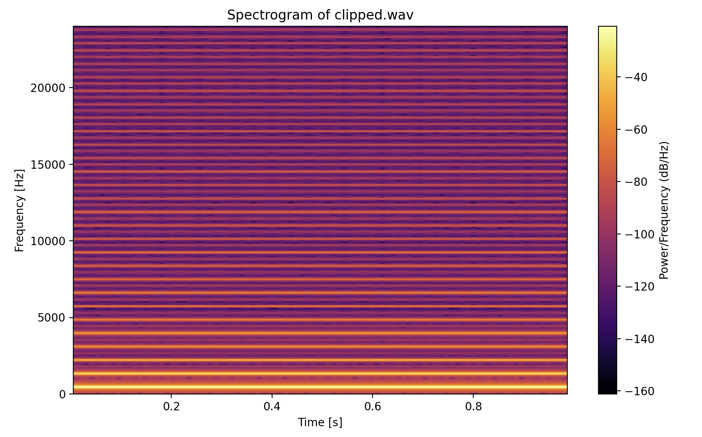
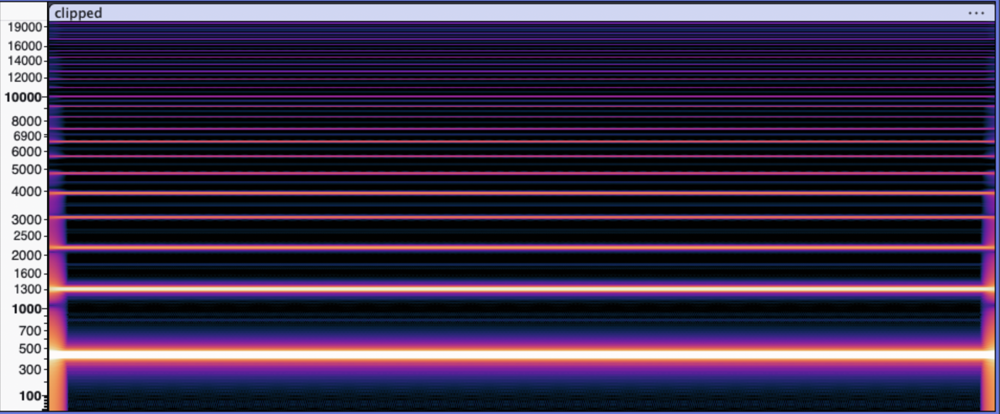

# (_Experiment_) Spectrogram Plotting - Irvin Lu

This `fft-spectogram.py` is a prototype of my own volition, where I test out with how Fast Fourier Transform is applied in the
digital audio landscape.

This code was written as a result of my research through the [Matplotlib](https://matplotlib.org/stable/api/_as_gen/matplotlib.pyplot.specgram.html) and [Scipy](https://docs.scipy.org/doc/scipy/reference/generated/scipy.signal.get_window.html) libraries in a personal
attempt to better visualize how FFT breaks down a signal and provides frequency information. By extension, I also looked into how
window functions factored into this application of a discrete fourier transformation.

## Comparing Spectrogram with Audacity

Comparing the results of `clipped.wav` between `fft-spectrogram.py` and Audacity, some patterns are revealed:

- From bottom to top, the lines get thinner in height.
  - Bottom line represents the **fundamental**, the most dominant frequency.
- Lines above the fundamental are **harmonics**
  - Produced from the clipping, which interrupts the linear, singular frequency of typical sine waves.
  - The repeated lines are equally spaced, aligning with how harmonics are multiples of the fundamental frequency.
- Single lines resemble little variance in frequency, which matches the redundant pattern of a sine wave.
- The "pillars" at the ends of the Audacity spectrogram likely is a result of signal being windowed for the FFT.

**Prototype Code:**

**Audacity:**

